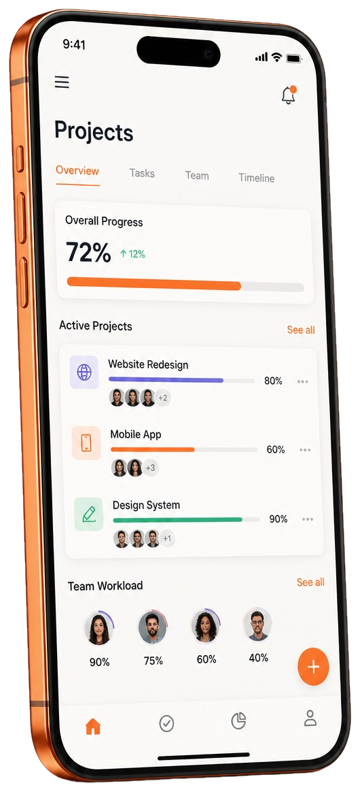

# Codigo

> **International product engineering for ambitious teams.**

Codigo is a polished React frontend for an international product studio. It presents the studio’s capabilities, selected work, engagement models, delivery options, open roles, contact paths, and legal information through a responsive editorial interface.

The project is built with **React 19**, **TypeScript**, **Vite**, and **Tailwind CSS 4**. The visual system is intentionally kept in a single global stylesheet so the experience remains consistent across desktop, tablet, and mobile layouts.



## What is included

| Area | Description |
|---|---|
| Product studio landing page | Hero, capabilities, selected work, recruitment, technology stack, engagement models, pricing, and contact sections. |
| Dedicated pages | About, How We Work, Vacancies, Contacts, and reusable legal pages. |
| Responsive experience | Mobile navigation, touch-friendly technology categories, fluid layouts, and responsive forms. |
| Editorial motion | Progressive section reveals, hover states, process illustrations, and the global Codigo assistant. |
| Netlify deployment | Production output with the SPA fallback rule preserved in `dist/_redirects`. |

## Technology

| Technology | Role |
|---|---|
| React 19 | Component-based user interface |
| TypeScript | Type-safe application code |
| Vite | Development server and production bundling |
| Tailwind CSS 4 | Utility foundation used alongside the project stylesheet |
| Lucide React | Interface icons |
| Netlify | Static hosting and SPA routing fallback |

## Project structure

```text
src/
├── app/
│   └── AppRouter.tsx              # Client-side route selection and navigation handling
├── components/
│   ├── Chatbot.tsx                # Global assistant mascot and conversation panel
│   ├── IconLibrary.tsx            # Service illustrations and technology icons
│   ├── PageHeroes.tsx             # Reusable editorial hero components
│   ├── SectionComponents.tsx      # Shared section, heading, field, tag, and link primitives
│   └── SiteShell.tsx              # Header, navigation, footer, shared buttons, and shell
├── data/
│   ├── legalContent.ts            # Legal page content registry
│   └── siteContent.ts             # Services, projects, pricing, stack, models, and vacancies
├── pages/
│   ├── AboutPage.tsx              # About page
│   ├── ContactsPage.tsx           # Direct contact page
│   ├── HomePage.tsx               # Home page composition
│   ├── HowWeWorkPage.tsx          # Process and capability page
│   ├── LegalPage.tsx              # Reusable legal page template
│   └── VacanciesPage.tsx          # Careers and open roles page
├── sections/
│   ├── ContactSection.tsx         # Reusable contact form section
│   ├── EngageSection.tsx          # Engagement model accordion
│   ├── HomeHero.tsx               # Home hero and phone preview
│   ├── JoinSection.tsx            # Recruitment and collaboration section
│   ├── PricingSection.tsx         # Delivery options and pricing cards
│   ├── ProcessSection.tsx         # Process rows and SVG artwork
│   ├── ServicesSection.tsx        # Capability cards and reusable service grid
│   ├── StackSection.tsx           # Interactive technology categories
│   └── WorkSection.tsx            # Selected project cards
├── styles/
│   └── siteStyles.css             # Global visual system, layout, responsive rules, and motion
└── main.tsx                       # React entry point
```

The previous page monolith has been removed. Each page and major section now has a clear home, while shared behavior remains in `components/` and editorial content remains in `data/`.

## Routes

| Route | Source file | Purpose |
|---|---|---|
| `/` | `src/pages/HomePage.tsx` | Main studio presentation |
| `/about` | `src/pages/AboutPage.tsx` | Studio background and company information |
| `/how-we-work` | `src/pages/HowWeWorkPage.tsx` | Product process and capabilities |
| `/vacancies` | `src/pages/VacanciesPage.tsx` | Open roles and general application |
| `/contacts` | `src/pages/ContactsPage.tsx` | Direct contact details |
| `/legal/privacy-policy` | `src/pages/LegalPage.tsx` | Privacy Notice |
| `/legal/terms-of-service` | `src/pages/LegalPage.tsx` | Service Terms |
| `/legal/cookie-policy` | `src/pages/LegalPage.tsx` | Cookie Notice |
| `/legal/trust-security` | `src/pages/LegalPage.tsx` | Trust & Safety |
| `/legal/dpa` | `src/pages/LegalPage.tsx` | Data Processing Terms |
| `/legal/sub-processors` | `src/pages/LegalPage.tsx` | Sub-Processor List |

## Getting started

### Requirements

Use a current Node.js release and npm. Install the project dependencies from the repository root:

```bash
npm install
```

### Development

Start the Vite development server with:

```bash
npm run dev
```

The application is configured for the project’s local development workflow and supports client-side navigation through the lightweight `pushState` router.

### Validation and production build

Run the type check and production build together before deployment:

```bash
npm run check
npm run build
```

The generated production files are written to `dist/`. The build must not be edited manually because it is regenerated from `src/` and `public/`.

## Deployment

Codigo is prepared for Netlify static hosting. Deploy the contents of `dist/` after running the production build. The SPA fallback file is kept at:

```text
dist/_redirects
```

Its purpose is to route direct visits to client-side paths back through `index.html`, allowing routes such as `/about` and `/legal/privacy-policy` to load correctly on a static host.

## Content and maintenance rules

Edit marketing copy and structured content in `src/data/siteContent.ts`. Edit legal copy in `src/data/legalContent.ts`. Reusable layout or interaction primitives belong in `src/components/`, while complete visual sections belong in `src/sections/`. Page files should primarily compose those pieces rather than duplicate them.

The design system is intentionally centralized in `src/styles/siteStyles.css`. This file contains the paper, soft, orange, and ink surfaces, typography rules, responsive breakpoints, section reveals, cards, navigation states, form styling, and mascot animation. Changes to visual design should be made deliberately and checked at desktop and mobile widths.

## Visual language

The interface uses **Inter** for body copy, **Inter Tight** for editorial headings, and **DM Mono** for technical labels. Its core palette is built around paper `#F8F6F3`, soft background `#F5F0EB`, orange `#E8471A`, and ink `#0D0B09`.

The site uses a lightweight client-side router rather than a server framework. Internal links are intercepted, browser history is updated with `pushState`, and each route resets the scroll position. The shared shell keeps navigation, footer, buttons, and the assistant consistent across all pages.

## Available scripts

| Command | Purpose |
|---|---|
| `npm run dev` | Start the Vite development server |
| `npm run check` | Run the TypeScript compiler without emitting files |
| `npm run build` | Generate the production bundle in `dist/` |
| `npm run format` | Format the project with Prettier |

## Repository hygiene

Generated folders such as `dist/` and installed dependencies should not be edited as source. Keep reusable code in the named directories above, keep content in the data registries, and use descriptive filenames so another developer can locate a feature without searching through an unrelated page file.
